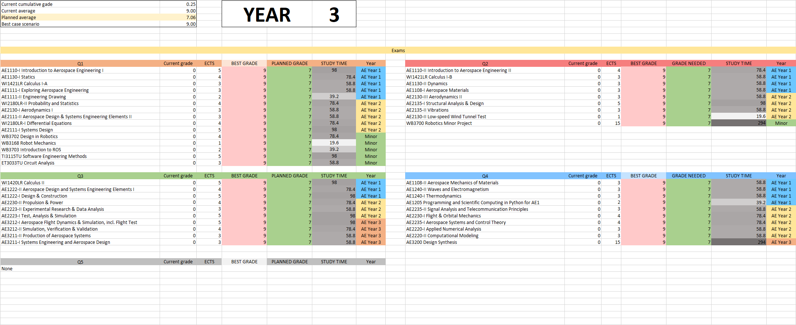
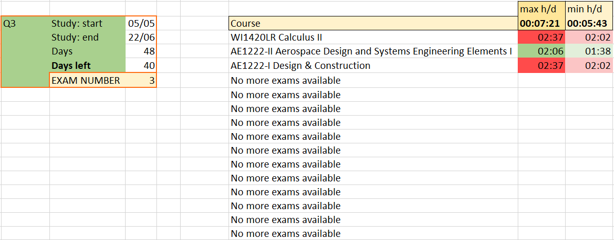

# Study planner and GPA calculator

Dashboard designed and tuned for the **TU Delft Aerospace Engineering Bachelor's** grade system. Copy your grades onto the `Courses` sheet and let the magic happen.

`Antonio Lopez Rivera, 2021`

[**1. Introduction**](#1-introduction)

[**2. Usage**](#2-usage)

[_2.1 Courses_](#21-courses)

[_2.2 Modules_](#22-modules)

[_2.3 Year dashboard_](#23-year-dashboard)

[_2.4 Quarter dashboard_](#24-quarter-dashboard)

[**3. Backlog**](#3-backlog)

---

## 1. Introduction

At some point in my Bachelor's I realized I could do with an effective way to

1. Visually inspect my progress
3. Plan my study and set my goals
2. Get a fair estimate of how much I must study (especially daily) to achieve my goals

It turned out to be a cool project to learn Excel. Hope you find some use in it!

## 2. Usage

The sheet consists of one "database", a module grade calculation sheet, and two dashboards: one for all exams in the year, and one to organize your quarter.

First, download the Excel sheet and open it in Excel.

### `2.1 Courses`

Navigate to the `Courses` sheet. For each course, there are 4 parameters to input:

- `Grade` (if you have taken the exam)
- `Maximum grade` - this is the maximum grade you believe you can achieve
- `Possible grade` - prettty obvious
- `Resit` - 1 if you intend on resitting the subject, empty if not

This is the database of the system. Everything beyond this is hands-off.

### `2.2 Modules`

Your module grades will be calculated automatically from the data in your `Courses` sheet. Course grade lookup happens with Regex, so you can sort the `Courses` sheet in whatever way you please without breaking the system.

### `2.3 Year dashboard`

Year-long exams dashboard, organized in quarters (from 1 to 5).

You can change 1 parameter: the year you're in, at the top. The exams which will appear in the dashboard (as well as the [ `quarter` ](#25-dashboard---quarter) dashboard) are obviously the ones available at your year and the years below.

NOTE: In the [ `quarter` ](#25-dashboard---quarter) dashboard you can set the quarter you're currently in. That, plus the year you're in are enough to display resits are handled as you'd expect: 
- If you have to resit a subject in your year, you'll see it in the quarter after the original exam
- If you have to resit a Year 2, Q2 subject, and you're in year 3, the following happens:
  - If you're in Year 3 Q2, you'll see the subject in your Q2 dashboard.
  - If you're in Year 3 Q3 (meaning you failed the resit and have to take it again) you'll see it in your Q3 dashboard
  - If you move on to Year 3 Q4 without having passed it, you'll have to retake it again in "Year 4" Q2: thus, it will move back to the Q2 dashboard

For the following examples, we'll say you have a 9 in Linear Algebra, and haven't done any other exams yet, as in the `Courses` example above. Below is the exams dashboard for years 1, 2 and 3 for that case (as expected, there's a lot of exams if you're in Year 3).

|  | 
| --- | 
|  |
|  |

### `2.4 Quarter dashboard`

In this dashboard you can specify 3 parameters:

- `Quarter` - either 1, 2, 3, 4 or 5. Introduce the numbers directly, the cells are formatted to display "Q{number}"
- `Study: start` - when do you plan on starting to study
- `Study: end` - usually the first day of exam week

You will immediately how many days are left until exams, which exams you need to do this quarter, as well as the time you must study daily in the study period you have specified to get: 

1. Your _maximum_ grade 
2. Your _possible_ grade

The time is calculated with each subject's ECTS. It's indicative, and probably an overestimation, so if you keep up with what this tells you you should be more than good. Good luck in your exams!
|  |  |
| --- | --- |
|  |  |

## 3. Backlog
All bug finds and suggestions are welcome! If you think you can improve this feel free to get in contact. 

Adding further flexibility and functionality seems a task better suited for a web or desktop application. It would be quite an interesting project too.

- Desktop/Webapp
