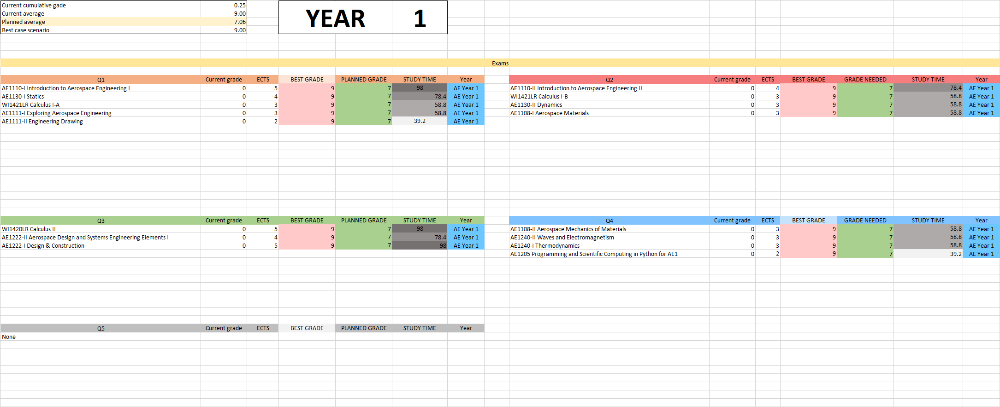
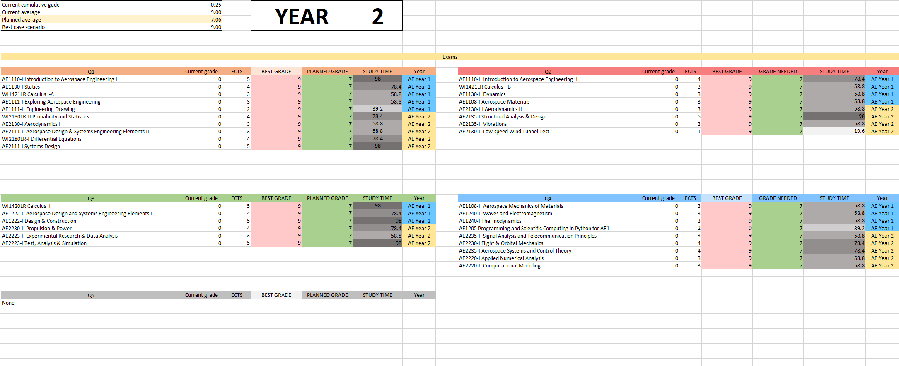

# Study Dashboard

Dashboard designed and tuned for the **TU Delft Bachelor's** grade system. Copy your grades onto the `Courses` sheet and let the magic happen. 

#### [1. Introduction](#1-introduction)

#### [2. Usage](#2-usage)

#### [3. Backlog](#3-backlog)

---

## 1. Introduction

At some point in my Bachelor's I realized I could do with an effective way to

1. Visually inspect my progress
3. Plan my study and set my goals
2. Get a fair estimate of how much I must study (especially daily) to achieve my goals

It turned out to be a cool project to learn Excel. Hope you find some use in it!

## 2. Usage

The sheet consists of one "database", a module grade calculation sheet, and two dashboards: one for all exams in the year, and one to organize your quarter.

First, download the Excel sheet and open it in Excel.

### `2.2 Courses`

Navigate to the `Courses` sheet. For each course, there are 4 parameters to input:

- `Grade` (if you have taken the exam)
- `Maximum grade` - this is the maximum grade you believe you can achieve
- `Possible grade` - prettty obvious
- `Resit` - 1 if you intend on resitting the subject, empty if not

This is the database of the system. Everything beyond this is hands-off.

### `2.3 Modules`

Your module grades will be calculated automatically from the data in your `Courses` sheet. Course grade lookup happens with Regex, so you can sort the `Courses` sheet in whatever way you please without breaking the system.

### `2.4 Dashboard - Exams`

Year-long exams dashboard, organized in quarters (excluding quarter 5, that might be included further on).

You can change 1 parameter: the year you're in, at the top. The exams which will appear in the dashboard (as well as the [ `quarter` ](#25-dashboard---quarter) dashboard) are obviously the ones available at your year and the years below.

Below is the exams dashboard for years 1, 2 and 3, if you have completed Linear Algebra alone, as in the `Courses` example above.

### `2.5 Dashboard - Quarter`

In this dashboard you can specify 3 parameters:

- `Quarter` - either "Q1", "Q2", "Q3" or "Q4"
- `Study: start` - when do you plan on starting to study
- `Study: end` - usually the first day of exam week

You will immediately have your exam count, which exams you need to do this quarter, as well as

- The time you must study daily in the study period you have specified to get: 1. your _maximum_ grade 2. your _possible_ grade.

---

## 3. Backlog
Adding further flexibility and functionality seems a task better suited for a web or desktop application. 

- Desktop app/Webapp?
